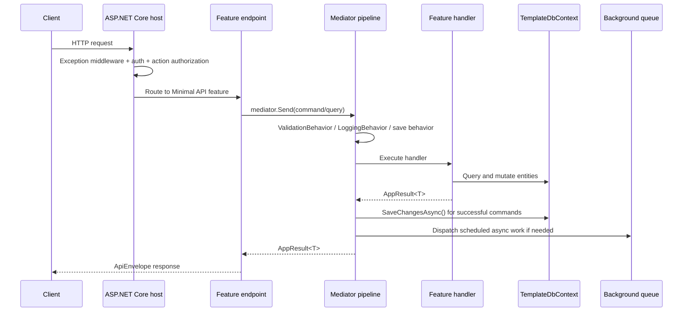

# temp-auth

`temp-auth` is a pragmatic **modular monolith** for authentication, users, roles, permissions, realtime hubs, and integration messaging.

The project is intentionally **feature-first** instead of layering everything into controllers, services, repositories, and “just one more abstraction” folders. The result is a codebase that is easier to navigate, easier to extend, and easier to keep honest.

## What this project is

At runtime this solution is a single ASP.NET Core application with:

- **Minimal APIs** for HTTP endpoints
- **Feature-based modules** for business use cases
- **Mediator + pipeline behaviors** for request orchestration
- **EF Core + PostgreSQL** for persistence
- **JWT + action-claim authorization** for security
- **SignalR** for realtime hubs
- **Redis Hybrid Cache** for caching capabilities
- **Wolverine + RabbitMQ** for integration messaging when enabled
- **Hosted background services** for in-process async work such as transactional emails

This is not trying to be “pure architecture.” It is trying to be **useful architecture**.

## Architecture in one picture

```mermaid
flowchart LR
	Client[Client / Frontend] --> Api[Template.Api\nThin host + middleware]
	Api --> Features[Template.Modules\nFeature slices]
	Features --> Db[(PostgreSQL)]
	Features --> Cache[(Redis / Hybrid Cache)]
	Features --> EmailQueue[In-process email queue]
	EmailQueue --> EmailWorker[Background email service]
	Features --> Contracts[Template.Integration\nIntegration contracts]
	Api --> Hubs[SignalR hubs]
	Api --> Bus[Wolverine / RabbitMQ\noptional integration bus]

	subgraph CrossCutting[Cross-cutting behavior]
		Validation[ValidationBehavior]
		Logging[LoggingBehavior]
		SaveBoundary[TransactionBehavior\n(save boundary for commands)]
		ResultShape[AppResult + ApiEnvelope]
	end

	Api --> Validation
	Api --> Logging
	Api --> SaveBoundary
	Api --> ResultShape
```

## Solution structure

| Project / Folder | Responsibility |
| --- | --- |
| `Template.Api` | Composition root, middleware pipeline, authentication, authorization, OpenAPI, hubs, app startup |
| `Template.Infrastructure` | Implementations for authentication, email, observability, messaging, time, authorization helpers, background services |
| `Template.Modules` | Business modules, domain entities, feature slices, EF Core `DbContext`, conventions, shared abstractions |
| `Template.Integration` | Integration event contracts for async boundaries |
| `Template.Tests` | Unit, integration, and architecture-oriented verification |
| `docker-compose.yml` | Local runtime stack: PostgreSQL, Redis, RabbitMQ, API |
| `.env` | Local environment variables expected by the application |

## Core architectural idea

The architecture is best described as:

- **Modular monolith** at deployment time
- **Vertical slice architecture** inside the application
- **CQRS-lite** for request modeling
- **Thin host, fat features** for clarity

### Why this shape works here

For this kind of product, most work is feature-centric:

- authenticate a user
- create a user
- list users
- change a password
- update role permissions

Putting each use case close to its endpoint, validator, request type, and handler reduces the amount of “jumping around the codebase” needed to understand a feature.

That is why the code prefers this:

- one feature file per use case
- direct `TemplateDbContext` access in handlers
- shared cross-cutting behavior in the pipeline

instead of this:

- controller
- application service
- domain service
- repository
- DTO mapper
- command service
- query service

for every small piece of behavior.

That heavier style can be useful in some systems, but in a project like this it often adds ceremony faster than it adds value.

## Runtime composition

`Template.Api/Program.cs` is intentionally thin. Its job is to compose the application, not to contain business logic.

At startup it does the following:

1. Configures logging with Serilog
2. Registers infrastructure services through `AddTemplateInfrastructure(...)`
3. Registers business modules through `AddTemplateModules(...)`
4. Adds mediator pipeline behaviors for validation, logging, and command persistence
5. Configures JWT bearer authentication and authorization policies
6. Exposes OpenAPI + Scalar docs
7. Configures Wolverine messaging if RabbitMQ settings are present
8. Maps endpoints and hubs
9. Runs database seeding

That keeps the host readable and makes the true application logic live in the modules where it belongs.

## Feature and request flow

The request flow is simple by design.



### What actually happens in code

For a typical command such as `CreateUser`:

1. The feature maps an endpoint with `MapPost`.
2. The endpoint sends a command through `IMediator`.
3. Validators run automatically through `ValidationBehavior`.
4. The handler performs business logic using `TemplateDbContext` and injected services.
5. The handler returns `AppResult<T>` instead of writing directly to the response.
6. If the command succeeds, `TransactionBehavior` performs a single `SaveChangesAsync()`.
7. Deferred side effects such as onboarding emails are dispatched after the successful save.
8. The endpoint converts the result into a uniform API response through `ToApiResult()`.

For a typical query such as `ListUsers`:

1. The feature maps a `GET` endpoint.
2. The endpoint sends an `IAppQuery<T>` through the mediator.
3. The handler reads with `AsNoTracking()` and shapes the response.
4. No write/save boundary is triggered.
5. The result is returned in the same API envelope shape.

## Module structure

Modules live under `Template.Modules/Modules/*`.

A module usually contains:

- `Domain/` for entities, enums, and EF configuration
- `Features/` for request handlers and endpoint definitions
- `*Module.cs` for DI registration
- `*FeatureInterfaces.cs` for route-group marker interfaces
- `*FeatureEndpointModule.cs` when a module wants custom route-group mapping or authorization rules

Example shape:

```text
Template.Modules/
  Modules/
	Users/
	  Domain/
		User.cs
		UserConfiguration.cs
	  Features/
		CreateUser.cs
		GetUser.cs
		ListUsers.cs
		UpdateUser.cs
		UsersFeatureInterfaces.cs
		UsersModule.cs
```

### Auto-discovery, not manual wiring

This solution deliberately uses convention-based discovery:

- `ITemplateModule` implementations are discovered by reflection
- `ITemplateEndpointModule` implementations are discovered by reflection
- `IFeature` implementations are discovered by reflection

That means you usually **do not edit a central registry** when adding a new feature.

If you follow the conventions, the app finds your new feature automatically.

## How to create a new feature

This is the happy-path workflow for adding a use case.

### 1. Pick the right module

If the feature belongs to an existing business area, add it there:

- auth-related work -> `Modules/Auth`
- user management -> `Modules/Users`
- tenant logic -> `Modules/Tenants`

Create a new module only when you are introducing a genuinely new business boundary, not just a new endpoint.

### 2. Add or reuse a feature route marker

Feature route grouping is driven by marker interfaces with `FeatureRouteTemplate`.

Example:

```csharp
[FeatureRouteTemplate("api/v1/users")]
internal interface IUsers : IFeature;
```

Any feature implementing `IUsers` is automatically grouped under `/api/v1/users`.

### 3. Add a feature file under `Features/`

Each feature is usually a single file containing:

- endpoint mapping
- request record (`Command` or `Query`)
- response record(s)
- validator
- handler

Typical shape:

```csharp
public sealed class CreateSomething : ISomething
{
	public void Map(IEndpointRouteBuilder app)
	{
		app.MapPost("/", async (CreateSomethingCommand command, IMediator mediator, CancellationToken ct) =>
			(await mediator.Send(command, ct)).ToApiResult("Created successfully"));
	}

	public sealed record CreateSomethingCommand(string Name) : IAppCommand<CreateSomethingResponse>;

	public sealed record CreateSomethingResponse(Guid Id, string Name);

	public sealed class Validator : AbstractValidator<CreateSomethingCommand>
	{
		public Validator()
		{
			RuleFor(x => x.Name).NotEmpty().MaximumLength(100);
		}
	}

	public sealed class Handler : IRequestHandler<CreateSomethingCommand, AppResult<CreateSomethingResponse>>
	{
		public async ValueTask<AppResult<CreateSomethingResponse>> Handle(CreateSomethingCommand command, CancellationToken ct)
		{
			// business logic here
			return AppResult<CreateSomethingResponse>.Success(new CreateSomethingResponse(Guid.NewGuid(), command.Name));
		}
	}
}
```

### 4. Choose command vs query deliberately

Use:

- `IAppCommand` / `IAppCommand<T>` for writes
- `IAppQuery<T>` for reads

That distinction matters because only commands participate in the centralized save boundary.

### 5. Use `TemplateDbContext` directly unless there is a strong reason not to

This codebase intentionally skips a repository layer for most use cases.

That means a handler typically depends on:

- `TemplateDbContext`
- one or two focused services such as `ICredentialHasher`, `ITokenService`, `IClock`, or an email dispatch abstraction

Do **not** add a repository just because “clean architecture says so.”

Add an abstraction only when it solves a real problem, for example:

- the behavior is reused heavily
- the dependency is external and unstable
- the code needs a test seam
- the data source may vary independently of the feature

### 6. Return `AppResult`, not ad-hoc responses

Handlers return `AppResult` / `AppResult<T>`.

That gives the API:

- consistent success envelopes
- consistent error envelopes
- one place to map domain/application errors to HTTP results

### 7. Do not call `SaveChangesAsync()` inside the handler unless there is a compelling exception

The project already centralizes successful command persistence through `TransactionBehavior`.

That gives you:

- one save boundary per command by default
- less repetitive boilerplate
- a single place to hang post-save side effects

### 8. Register module-level services only when needed

If your module needs custom services, register them in its `*Module.cs` file through `ITemplateModule.AddServices(...)`.

If your module needs special route grouping or group-wide authorization, use an `ITemplateEndpointModule`.

### 9. Add tests in the right place

Use:

- `Template.Tests/Unit` for handler and validator tests
- `Template.Tests/Integration` for end-to-end feature tests
- architecture tests if you need to enforce conventions automatically

## Cross-cutting behavior worth knowing

### Authentication and authorization

- JWT bearer authentication is configured in `Template.Api/Program.cs`
- action-based authorization is enforced by `ActionClaimsAuthorizationMiddleware`
- administrators bypass per-action checks
- features can opt into `AllowAnonymous()` or `RequireAuthorization()` directly at the endpoint

This gives the app both:

- coarse-grained auth through policies/roles
- fine-grained auth through action claims

### Tenant isolation

Tenant scope is derived from the authenticated user and exposed through `ICurrentTenant`.

`TemplateDbContext` uses that tenant information in query filters so tenant-scoped entities are automatically isolated.

This is one of the biggest advantages of centralizing tenant concerns in infrastructure and persistence instead of scattering them across handlers.

### Auditing and soft delete

`TemplateDbContext` applies:

- created/updated timestamps
- created/updated user tracking
- soft delete conversion for `BaseEntity` entities
- UTC normalization for `DateTimeOffset`

That means features can focus on business intent instead of remembering the same audit boilerplate over and over.

### Async work and messaging

There are two different async patterns in the solution:

1. **In-process background work** for transactional emails using `TransactionalEmailChannelHub` + `TransactionalEmailBackgroundService`
2. **Integration messaging** through Wolverine and RabbitMQ when the relevant environment variables are configured

That distinction matters:

- the email queue is simple and fast for app-local work
- RabbitMQ/Wolverine is the better boundary for service-to-service communication and integration events

## Design patterns used here — and why

These patterns are used because they solve specific problems in this codebase, not because they look impressive on a slide deck.

| Pattern | Where it appears | Why it is used here | When not to overdo it |
| --- | --- | --- | --- |
| **Composition Root** | `Template.Api/Program.cs`, `InfrastructureServiceExtensions.cs` | Keeps application startup centralized and readable | Don’t let startup become a dumping ground for business logic |
| **Modular Monolith** | `Template.Api` + `Template.Modules` + `Template.Infrastructure` | Single deployable, simpler operations, still preserves business boundaries | If modules need independent deployment/scaling, move toward services |
| **Vertical Slice Architecture** | `Modules/*/Features/*.cs` | Keeps each use case self-contained and easy to trace | If a slice grows huge, split internal helpers instead of creating random shared layers |
| **CQRS-lite** | `IAppCommand*`, `IAppQuery*` | Makes reads and writes explicit without forcing separate databases | Don’t split infrastructure just for the label |
| **Mediator** | `IMediator`, feature handlers | Decouples endpoints from business handlers and enables pipeline behaviors | Don’t hide trivial in-process logic behind extra hops when direct code is clearer |
| **Pipeline / Chain of Responsibility** | `ValidationBehavior`, `LoggingBehavior`, `TransactionBehavior` | Centralizes repeated concerns once for all features | Too many hidden behaviors make debugging harder |
| **Unit of Work** | `TemplateDbContext : IUnitOfWork` | Gives commands one clear save boundary | It is not a substitute for distributed consistency across external systems |
| **Result Pattern** | `AppResult`, `AppResult<T>`, `ToApiResult()` | Keeps API responses and failures consistent | Reserve exceptions for exceptional failures, not routine validation |
| **Strategy via interfaces** | `ICredentialHasher`, `ITokenService`, `IClock`, `ICurrentUser`, `ICurrentTenant` | Swappable infrastructure implementations and cleaner tests | Don’t create abstractions around stable framework behavior for no reason |
| **Convention over Configuration** | reflection-based module and feature discovery | Lets new features plug in with minimal registration friction | Reflection magic is fine only if conventions stay obvious |
| **Producer / Consumer background processing** | `TransactionalEmailChannelHub`, `TransactionalEmailBackgroundService` | Keeps request latency down for non-immediate work | In-process queues are not durable enough for every critical workflow |

## Why this is better than a more complicated architecture

For **this** codebase, this architecture is better than a heavier alternative because it optimizes for the actual problems the app has today.

### What it avoids

It avoids needing all of this for every simple use case:

- a controller
- a service interface
- a service implementation
- a repository interface
- a repository implementation
- a mapper layer
- duplicate DTO models in multiple projects

That kind of structure can look “enterprisey,” but for CRUD-heavy SaaS backends it often creates:

- more files per feature
- more indirection per bug fix
- harder onboarding
- fake abstractions that do not hide meaningful complexity

### What it gains instead

- **Local reasoning**: most feature logic lives in one file
- **Low ceremony**: new endpoints are fast to add
- **Consistent behavior**: validation, logging, persistence, and result formatting are centralized
- **Operational simplicity**: one deployable, one app boundary
- **Refactoring friendliness**: modules can later be extracted if the business truly outgrows the monolith

### But this is not a religion

This architecture is **not always better**.

You should consider something heavier or more distributed when:

- multiple teams need independent deployment cadence
- one module must scale very differently from the others
- cross-service durability guarantees become critical
- the domain becomes rich enough to justify deeper aggregate/domain modeling
- read and write models diverge so much that separate read stores are warranted

In short:

> This architecture is better **when simplicity is an advantage** and **worse when simplicity starts hiding real complexity**.

That is the tradeoff to keep in mind.

## Guardrails for keeping the architecture healthy

When adding new code, prefer these rules:

1. **Add features, not layers**.
2. **Keep endpoints thin**; put business logic in handlers.
3. **Return `AppResult`** for predictable API output.
4. **Let commands save through the shared behavior**.
5. **Prefer direct `TemplateDbContext` usage** over premature repositories.
6. **Use `AsNoTracking()` for read-heavy queries**.
7. **Keep module boundaries business-oriented**, not technical.
8. **Use abstractions only when they buy clarity, testability, or replacement value**.
9. **Move repeated logic into focused services**, not into generic “helper” dumping grounds.
10. **If a pattern adds more ceremony than clarity, do not introduce it.**

## Running the architecture locally

The repo includes:

- `docker-compose.yml` for PostgreSQL, Redis, RabbitMQ, and the API
- a root `.env` file with placeholder/local values for required environment variables

Before running locally, review `.env` and adjust the secrets and endpoints for your environment.

## Short version

This project uses a **modular monolith + vertical slice** approach because it gives a strong middle ground:

- simpler than a microservice fleet
- cleaner than a giant everything-in-one-project blob
- less ceremonial than classic controller/service/repository layering
- structured enough to grow without turning into soup

It is a pragmatic architecture for teams that want **speed, clarity, and maintainability** without pretending every CRUD feature needs a PhD thesis in indirection.